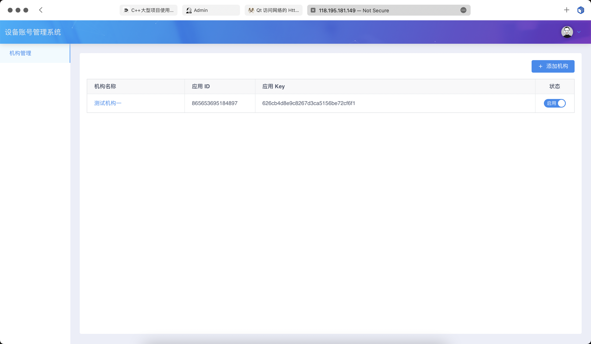
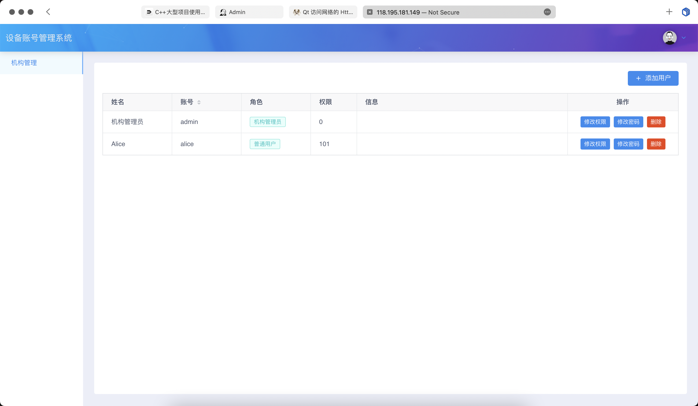
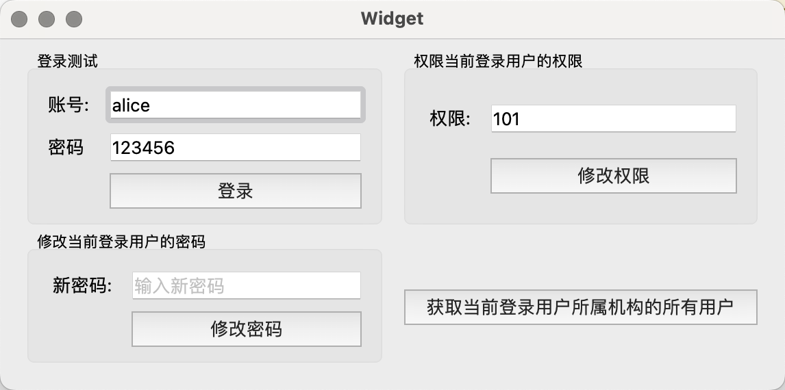
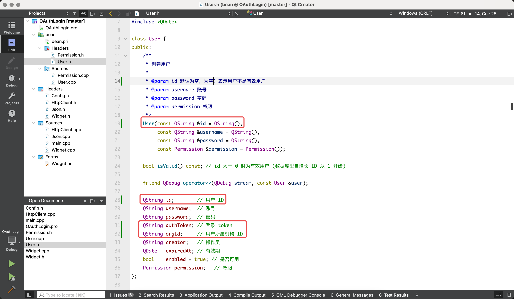
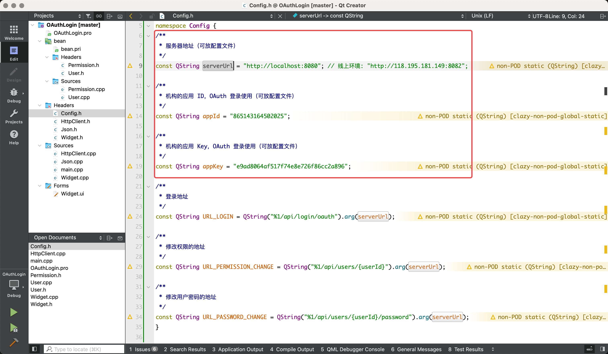
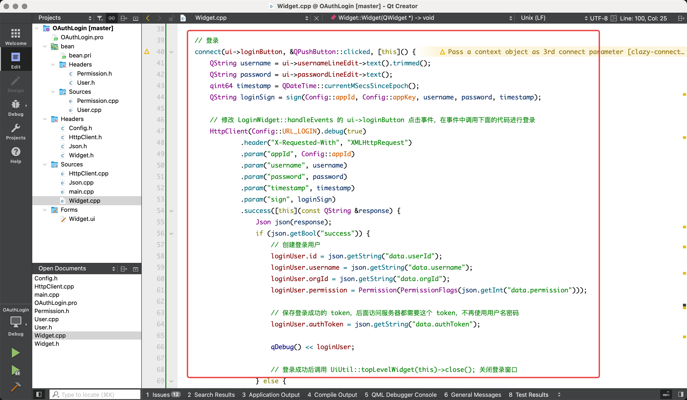
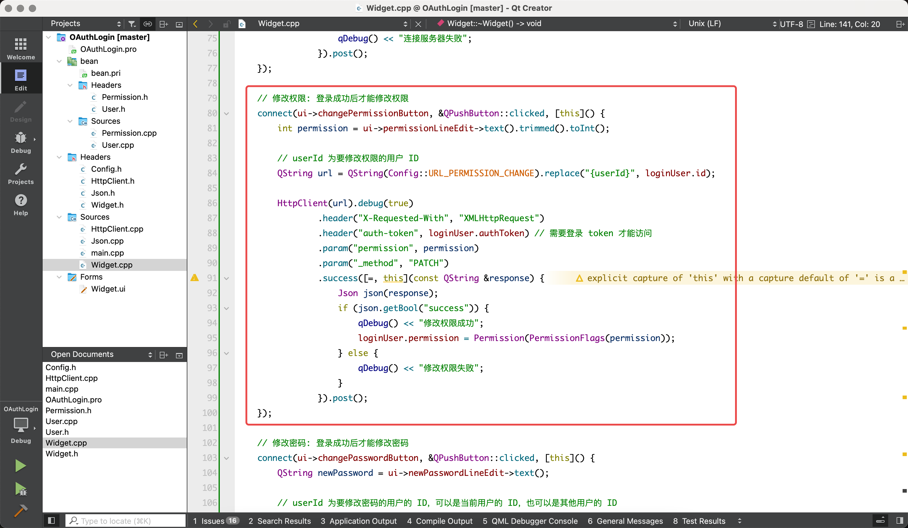
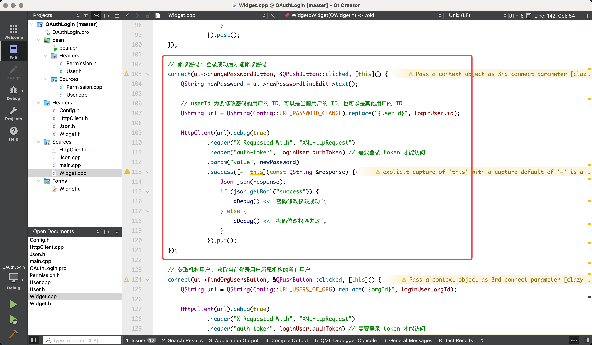

服务器: 

* URL: <http://118.195.181.149:8082/admin>
* 账号: admin
* 密码: admin

## 机构和用户管理

### 机构管理：

### 机构的用户管理

## 操作 Demo

操作 Demo 中演示了图中几种操作，展示了 Qt 程序中使用 API 修改在线服务器中的用户信息:

1. 登录
2. 登录成功后：修改权限、密码、获取机构用户
3. 每个操作的结果查看控制台输出

## User 更新

更新内容:

* 把 id 类型从 int 修改为 QString 
* 增加属性 authToken: 登录成功后服务器返回的登录凭证，修改权限、密码、创建用户等需要此凭证
* 增加属性 orgId: 用户所属的机构 ID，每个机构可以独立管理自己的用户，机构被禁用后它下面的所有用户都不能登录

复制 **bean/User.h** 和 **bean/User.cpp** 替换项目中的文件。

## 配置

访问服务器需要 3 个参数:

* serverUrl: 服务器地址
* appId: 机构的应用 ID
* appKey: 机构的应用 Key

此 3 个参数可以放在配置文件中，但是 Demo 中为了简单直接写死到了 Config.h，其他几个地址都是固定的：

## 登录

参考 Widget 构造函数中的登录例子。

## 修改权限

参考 Widget 构造函数中的修改权限例子。

## 修改密码

参考 Widget 构造函数中的修改密码例子。

## 获取机构用户

参考 Widget 构造函数中的获取登录用户所属机构用户例子。

