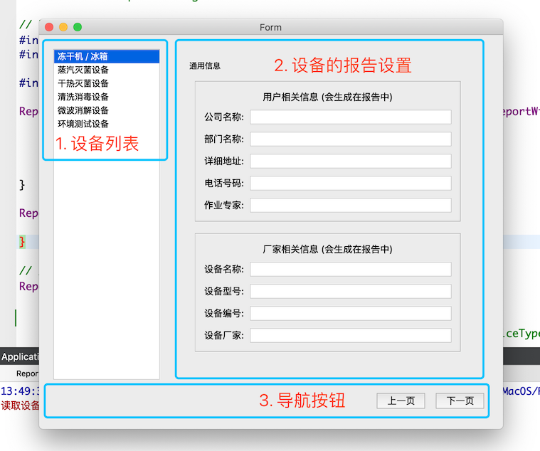
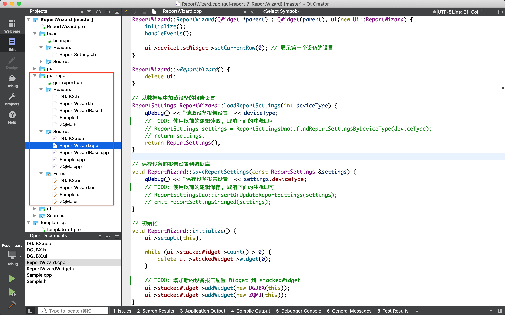

## 界面布局

报告设置分为 3 个部分:

1. 设备列表
2. 每个设备的报告设置 (每个设备对应一个独立设置的 Widget, 提示: 如果有某几个设备的设置完全一样, 使用同一个设置的 Widget 各自创建一个对象即可)
3. 导航按钮: 点击进行切换设置的上一页, 下一页, 最后一页时自动显示保存按钮



## 代码管理

报告向导的类主要在 `gui-report` 模块下:

* `gui-report/ReportWizard` 为报告向导的主界面

* `gui-report/ReportWizardBase` 为每个设备报告设置界面的基类

* `gui-report/Sample`, `gui-report/DGJBX`, `gui-report/ZQMJ` 都是设备的报告设置界面实现

  名字是不是很怪? 因为 `冻干机 / 冰箱`, `蒸汽灭菌设备` 等名词专业英文不会写, 所以他们的设置界面的类名就直接使用汉语拼音的首字母作为类名了



## 增加新的报告设置

增加新的报告设置请参考 `gui-report/Sample` 或者 `gui-report/DGJBX` 的实现, 主要为以下几步:

1. 创建一个 QWidget 子类, 继承 ReportWizardBase
2. Ui 中使用 QStackedWidget 创建多个设置的页面
3. 构造函数中调用 `ReportWizardBase::initialize(ui->stackedWidget)` 初始化 ReportWizardBase
4. 实现报告设置的纯虚函数
   * `setReportSettings()`:  报告设置显示到界面上, 即把设置显示到对应的 widget 上
   * `getResportSettings()`: 获取报告设置, 即把 widget 上的设置提取出来创建返回 ReportSettings 对象

5. 在 ReportWizard 界面的左边 QListWidget 中增加设备名字

6. 在 `ReportWizard::initialize()` 中增加设备对象到 stackedWidget 中

   ```cpp
   // 初始化
   void ReportWizard::initialize() {
       ui->setupUi(this);
   
       while (ui->stackedWidget->count() > 0) {
           delete ui->stackedWidget->widget(0);
       }
   
       // TODO: 增加新的设备报告配置 Widget 到 stackedWidget
       ui->stackedWidget->addWidget(new DGJBX(this));
       ui->stackedWidget->addWidget(new ZQMJ(this));
   }
   ```

   注意 list 中设备的顺序和 stackedWidget 中设备对应报告设置的 Widget 的顺序要一致.

## 使用数据库保存配置

把报告向导移植到项目中时, 修改 `ReportWizard::loadReportSettings` 和 `ReportWizard::saveReportSettings` 为下面的样子, 使用数据库保存配置:

```cpp
// 从数据库中加载设备的报告设置
ReportSettings ReportWizard::loadReportSettings(int deviceType) {
    ReportSettings settings = ReportSettingsDao::findReportSettingsByDeviceType(deviceType);
    return settings;
}

// 保存设备的报告设置到数据库
void ReportWizard::saveReportSettings(const ReportSettings &settings) {
    ReportSettingsDao::insertOrUpdateReportSettings(settings);
    emit reportSettingsChanged(settings);
}
```

