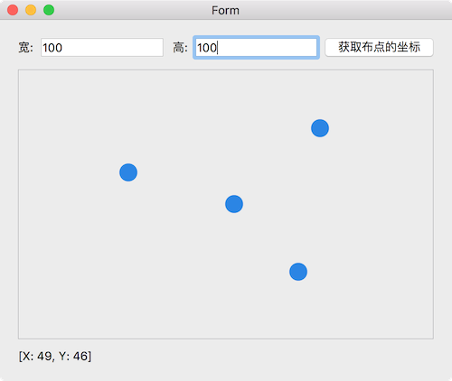

布点功能涉及 3 个类:

* Scatter: 点
* ScatterMap: 布点的地图
* Widget: 程序的窗口，放置 ScatterMap 和一些业务相关的 widget

主要功能有：

* 设置布点地图的大小
* 获取所有布地点的坐标
* 右键菜单添加点
* 右键菜单删除点
* 拖拽移动点

## Scatter

Scatter 是 ScatterMap 上布的点，坐标有相对于 ScatterMap 的相对坐标 (`xRatio, yRatio`)，也有在 ScatterMap 上的绝对坐标 (调用 `getPosition()` 获取)。

Scatter 相关的功能有:

* 右键删除
* 鼠标拖拽移动，移动时发射信号 `positionChanged`
* 鼠标移动到它上面是使用 tool tip 显示它在 ScatterMap 上的绝对坐标

Scatter 的大小和颜色使用 QSS 控制，在 main() 函数中:

```cpp
window.setStyleSheet(".Scatter { background: #2b85e4; border-radius: 10px; min-width: 20px; max-width: 20px; min-height: 20px; max-height: 20px; }");
```

## ScatterMap

布点地图，在上面鼠标右键可以添加 Scatter 到地图上，地图的大小使用逻辑值 (`scatterMapWidth, scatterMapHeight`)，而不是 ScatterMap 在界面上的像素大小，这样当地图随着窗口变形后，地图的实际大小不受影响，由于 Scatter 的相对坐标不变，计算出来的 Scatter 的绝对坐标也不会随着窗口的变化而变化。