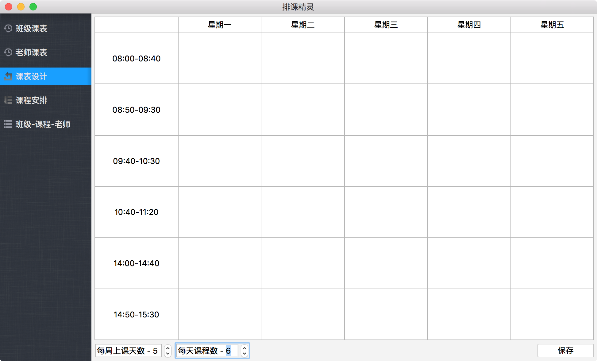
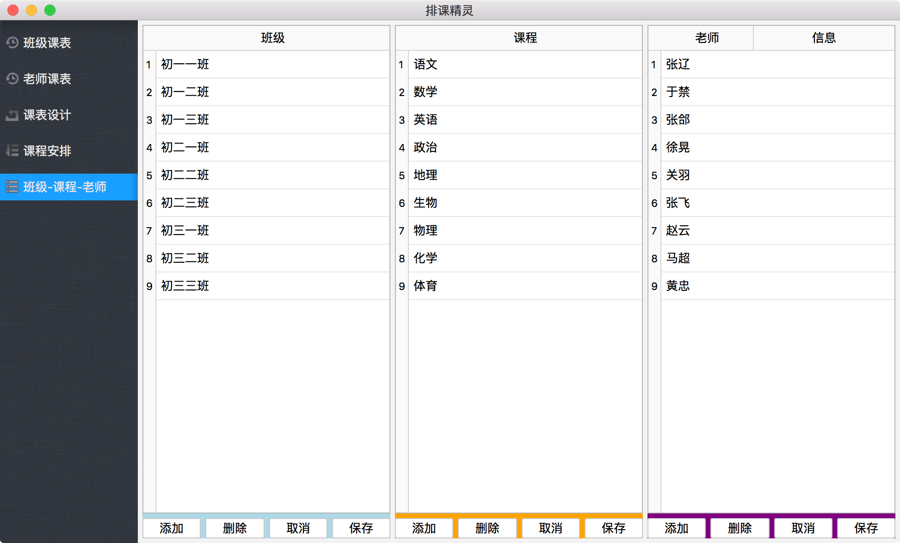
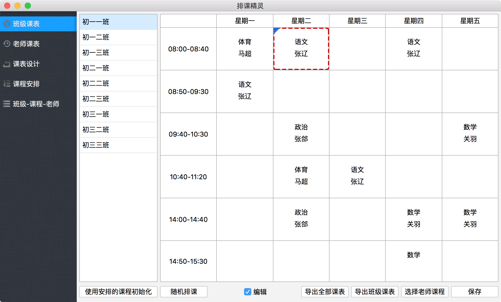
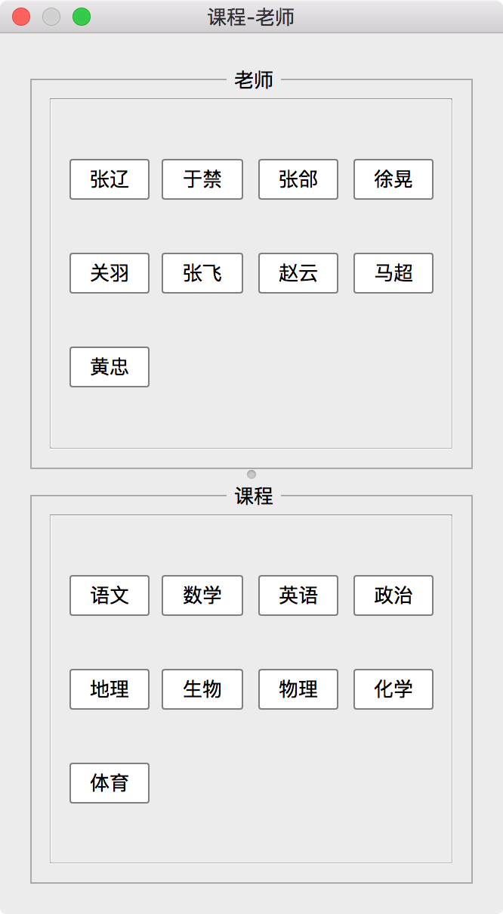
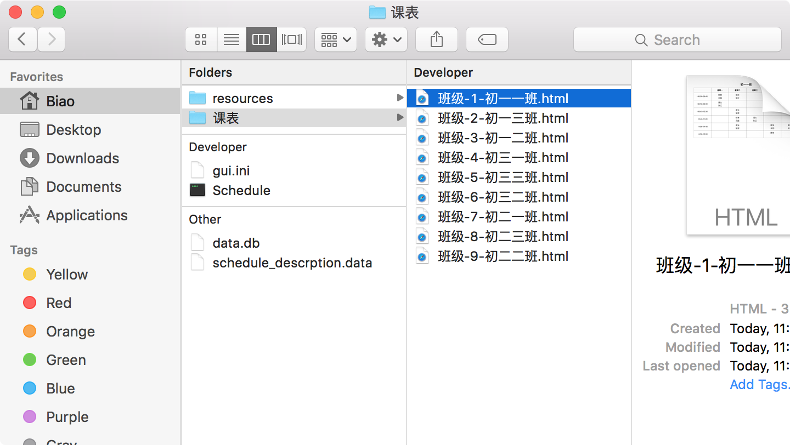
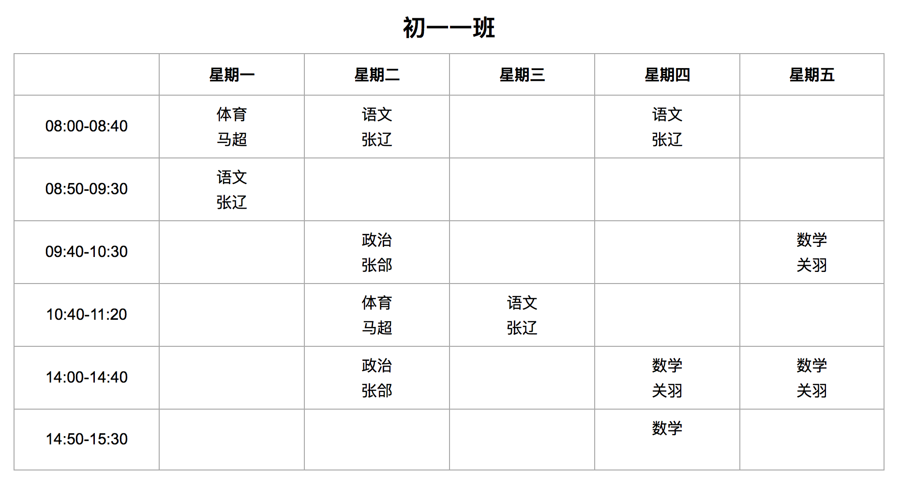
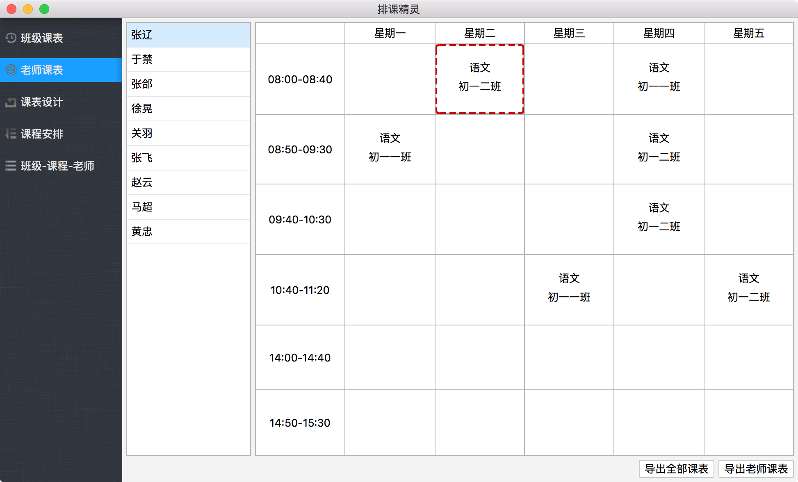
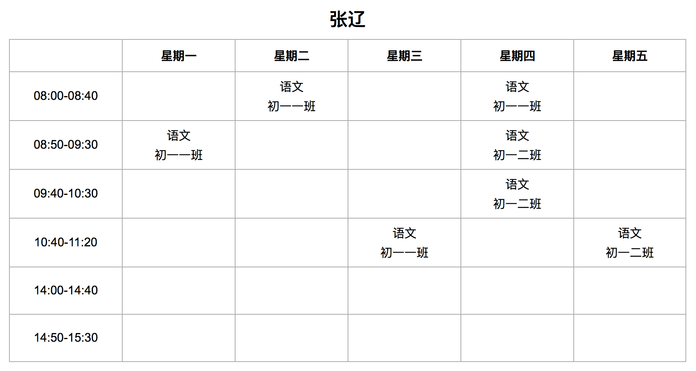
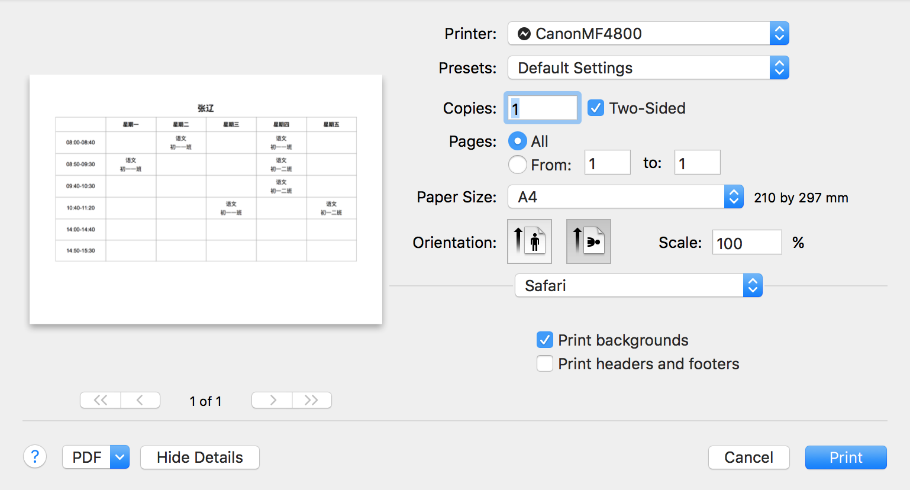

# 使用说明

## 一、设计课表
1. 调整 `每周上课天数`: 最少 5 天，最大 7 天
2. 调整 `每天课程数`: 最少 4 节，最多 10 节
3. 右上角填写课表使用的时间，例如 `2016 年 9 月 1 日`，导出课表时显示在课表的右上角
4. 调整好后点击保存

## 二、初始化班级、老师、课程
> 添加、删除操作后都需要点击 `保存` 按钮，否则修改不会被保存，切换到其他界面时修改会丢失  
> 点击 `取消` 按钮取消未保存的修改

## 三、课程安排
1. 给每个班的课程安排上课的老师，要上几节课等
2. 点击不同的班级后会加载这个班级的排课信息
3. 修改后记得点击 `保存` 按钮进行保存

## 四、给班级排课
1. 程序启动后为写保护状态，不能进行排课，防止误操作，只有点击选中 `编辑` 后才可以进行排课
2. 点击不同的班级后会加载这个班级的课程表
3. 开始的时候班级的课程表是空的，点击 `使用安排的课程初始化` 按钮加载默认的排课信息
4. 双击课表中的项，使用为锁定状态不可以被修改(左上角一个蓝色的三角形)
5. 点击 `随机排课` 按钮随机的打乱课表(锁定状态的项不受影响)
6. 如果同一节课，老师在其他班级已经安排过了，那么课表项显示为红色的虚线框
7. 拖拽课表项到其他课表项上，交换他们
8. 如果课表有小的变化，例如周一的第一节 `体育` 原来是安排 `马超` 老师上的，但是现在安排 `张辽` 来上，那么点击 `选择老师班级` 按钮打开 `老师和班级` 的窗口，从老师的列表中拖拽 `张辽` 到 `体育` 上就可以把老师从 `马超` 替换为 `张辽` 了
9. 修改老师上的课程，同第 8 步一样，拖拽课程到对应的课表项上即可
10. **修改完成后别忘了点击 `保存`，否则切换到其他班级的时候修改会丢失**
11. 点击 `导出班级课表` 导出当前选中班级的课表
12. 点击 `导出全部课表` 导出所有班级的课表

## 五、导出班级课表
在 `班级课表` 的界面中导出班级的课表，课表文件保存在软件的 `课表` 文件夹下，是网页类型的 HTML 文件，推荐使用 `QQ 浏览器` 打开，Windows 自带的 `IE 浏览器` 打开的效果不是很好。

1. 导出选中班级的课表: 点击 `导出班级课表`，名字为 `班级名.html`
2. 导出所有班级的课表: 点击 `导出全部课表`，名字为 `班级-数字-班级名.html`

## 五、导出老师课表
在 `老师课表` 的界面中导出班级的课表

1. 导出选中老师的课表: 点击 `导出老师课表`，名字为 `老师名.html`
2. 导出所有老师的课表: 点击 `导出全部课表`，名字为 `老师-数字-老师名.html`

## 六、打印课表
使用 `QQ 浏览器` 打开课表文件，然后打印，打印的时选择 `A4` 纸，横的方向(具体看实际打印选项的设置)

