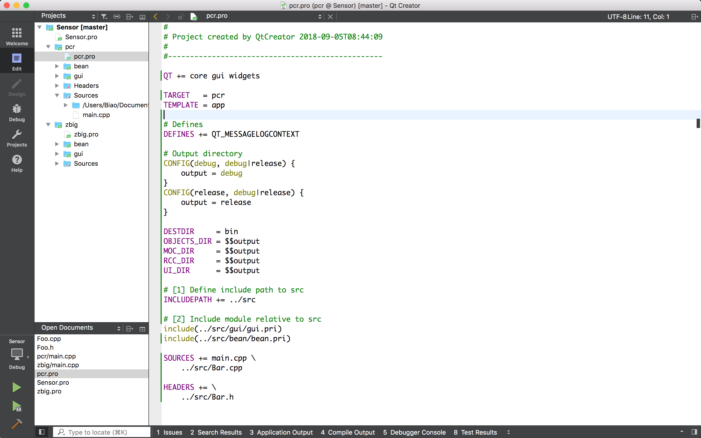

使用子工程，共享源码的方式管理 Sensor 的项目，Qt Creator 中的视图: `Sensor` 是总工程，`pcr` 和 `zbig` 是子工程:



源码目录结构:

```
Sensor/
    ├── Sensor.pro
    ├── Sensor.pro.user
    ├── pcr
    │   ├── main.cpp
    │   └── pcr.pro
    ├── zbig
    │   ├── main.cpp
    │   └── zbig.pro
    ├── src
    │   ├── Bar.cpp
    │   ├── Bar.h
    │   ├── bean
    │   │   ├── Foo.cpp
    │   │   ├── Foo.h
    │   │   └── bean.pri
    │   └── gui
    │       ├── Widget.cpp
    │       ├── Widget.h
    │       ├── Widget.ui
    │       └── gui.pri
```

* 目录 `pcr` 和 `zbig` 是子工程的目录，各自有自己的 .pro 和 main.cpp 文件，各自的资源文件 (例如数据库文件，配置文件等) 也放到自己的目录下，这样方便管理，避免资源文件交叉污染，也方便定制
  * .pro 文件用于引入功能的文件，定制输出名称，路径等
  * main.cpp 是程序的入口文件
* 在各自的 .pro 文件里包含需要的 .h 和 .cpp 文件
* 公共的源码文件放在目录 `src` 中，可以在各个工程中共享，为了使用模块的方式管理源码，每个模块的源码使用 `.pri` 的方式管理和引入 (现有项目已经这么处理了)
* 当一个子工程中修改了共享的源码后，其他子工程也能立即自动得到新的变化

> 可能需要注意点的是引入 src 目录下没有使用 .pri 管理的 .h 和 .cpp 文件，要使用相对路径 `../src/Bar.h` 来引入，而不能直接使用 `Bar.h`，请参考 pcr.pro 中的引入示例。